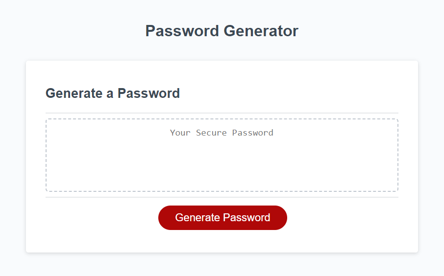

# Module 3 Challenge: Javascript Password Generator

## Description

Modified starter code to create an application that enables employees to generate random passwords based on criteria that they’ve selected.

## Installation

N/A

## Usage

[Link to website](https://gurleyryan.github.io/javascript-password-generator/)

Pressing the generate password button will initiate multiple prompts asking how long of a password and what types of characters you would like. Once preferences are specified, your password will be shown.

## Credits

The Module 3 Activity 8 Logical Comparison Operators bonus question asked what "NaN" means, which lead me to this website.

https://mkyong.com/javascript/check-if-variable-is-a-number-in-javascript/

The isNaN function is used in the generatePassword function.

## License

Please refer to the LICENSE in the repo.